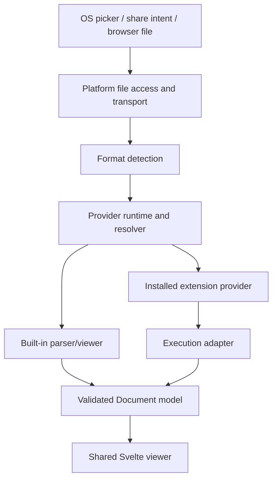

# ViewIt Architecture

ViewIt opens files locally across web, desktop, and Android. The current architecture combines statically linked format handlers with optional downloadable Android extensions. It is being consolidated around three modules: distribution, provider runtime, and execution adapters.

## File Flow

Today, some plugin operations still bypass `@viewit/platform` through the Android WebView bridge. Those calls are legacy seams being consolidated behind distribution and execution adapters. `@viewit/platform` is the shared file/platform module, not yet the only frontend-to-host seam.

## Architecture Modules

### Distribution

Owns signed catalog verification, artifact checksums, compatibility, download, extraction, install/update/remove, and eventually rollback. Package integrity proves which bytes were approved; it does not sandbox those bytes.

Current Android implementation: `PluginManager.kt`, plugin catalog scripts, and package validation scripts.

### Provider runtime

Will own versioned service discovery, provider resolution, activation scopes, dependencies, health, fallback, and diagnostics. Current routing is split across `Viewer.svelte`, `runtimeRouting.ts`, `pluginBridge.ts`, and Android plugin lookups.

Built-in handlers will participate as built-in providers without becoming dynamically loaded.

### Execution adapters

Will hide runtime-specific invocation details. Initial adapters cover built-in Rust/platform code, Android Dex/native extensions, and WebView JavaScript extensions. Isolation can be added through a different adapter without rewriting viewers or resolution.

## Current Trust Model

Current downloadable Android plugins are trusted in-process extensions:

- Dex and native code execute in the app process.
- WebView JavaScript executes in the main app WebView.
- Catalog signatures and artifact checksums establish integrity and publisher trust.
- They do not provide process, filesystem, network, or memory isolation.

The target architecture recognizes built-in, trusted in-process, and isolated trust classes. Isolation is an execution-adapter concern, not a per-plugin Activity requirement.

## Target Transport

| Target | Host | Typical byte/result transport |
|---|---|---|
| Web | Browser + WASM | In-process browser memory and object URLs |
| Desktop | Tauri/Rust | IPC and localhost streaming where needed |
| Android | Tauri/Rust + Kotlin | Content URIs, app-private materialization, streaming, and typed bridge messages |

See [`../STREAMING-ARCHITECTURE.md`](../STREAMING-ARCHITECTURE.md) for byte transport and [`../PLUGIN-ARCHITECTURE.md`](../PLUGIN-ARCHITECTURE.md) for extension/provider architecture.

## Build Profiles

ViewIt product profiles are separate from Gradle build-type names:

- `development`: local diagnostics and unsigned local catalog workflows.
- `device-test`: optimized connected-device artifact with diagnostics, but signed catalogs by default.
- `production`: production signing required; debugging and local plugin installation disabled.

The current standard Android script defaults to `device-test`. A successful Gradle `release` build is not itself a ViewIt production release.
