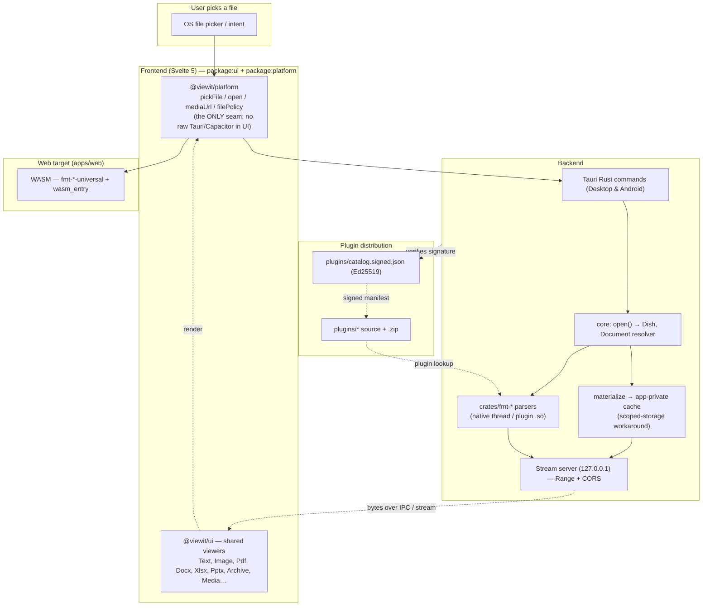

# Architecture

> High-level view of how a file flows from user choice to on-screen render,
> across the three targets (desktop, Android, web). See also
> [`../STREAMING-ARCHITECTURE.md`](../STREAMING-ARCHITECTURE.md) for the byte
> transport details and [`../PLUGIN-ARCHITECTURE.md`](../PLUGIN-ARCHITECTURE.md)
> for the plugin catalog model.

## Flow

## Target → transport

| Target | Command host | Byte transport to viewer |
|---|---|---|
| Desktop (`apps/desktop`) | Tauri IPC (raw) | `stream_url` over localhost HTTP, Range-supported |
| Android (`apps/mobile`) | Tauri IPC (base64) | bytes materialized to app-private cache, read over IPC or `stream_url` (CORS-enabled) |
| Web (`apps/web`) | WASM (`fmt-*-universal`) | in-process memory; no network |

## Why the Android path uses the app cache

Android scopes `/sdcard/Download` access. When `MANAGE_EXTERNAL_STORAGE` is
revoked, the raw-URI stream read returns `EACCES`, and the stream server
previously returned a **non-CORS** 500 — which the WebView reports as an opaque
`TypeError: Failed to fetch` (`<video>/<audio>` → `code 4`). Two consistent
fixes:

1. Materialize shared files into the app-private cache at open time and serve
   bytes from there (`std::fs`, Range-supported) — permission-independent.
2. All stream-server responses (success *and* error) carry
   `Access-Control-Allow-Origin`, so failures surface as readable HTTP status.

See ADR `docs/adr/0010-webview-pdf-and-asset-streaming.md`.

## Viewing this diagram

The Mermaid source above renders on GitHub and in most Markdown viewers. For a
standalone SVG: `npx -y @mermaid-js/mermaid-cli -i docs/architecture/architecture.mmd`.
